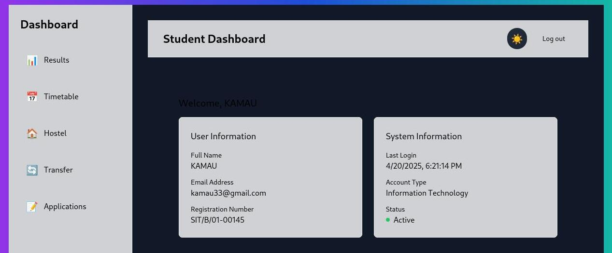

# 🎓 Student Dashboard

A responsive and modern student dashboard built with **React**, **TypeScript**, **Tailwind CSS**, and **React Router**, designed to help students manage their academic information like results, timetable, hostel booking, transfer requests, and other applications.

---
### 🌙 Desktop View (Dark Mode)

## 🌟 Features

- 📅 Timetable view with weekly schedule
- 📊 Academic results display
- 🏠 Hostel booking form
- 🔄 Transfer request form
- 📝 Application submission
- 📱 Mobile-friendly responsive design
- 🌗 Dark and light theme switch
- 📁 Sidebar drawer toggle on mobile
- 🔔 Toast notifications using Sonner
- ♿ Accessibility friendly

---

## 🚀 Technologies Used

- React + TypeScript
- Tailwind CSS
- React Router DOM
- Sonner (toast notifications)
- Vite (build tool)

---

## 📁 Project Structure

src/ ├── components/ # Reusable components (e.g., WaveBackground, Sidebar) ├── pages/ # Individual dashboard sections (Results, Timetable, etc.) ├── services/ # Auth services and utility functions ├── App.tsx # Main app component with routes └── main.ts